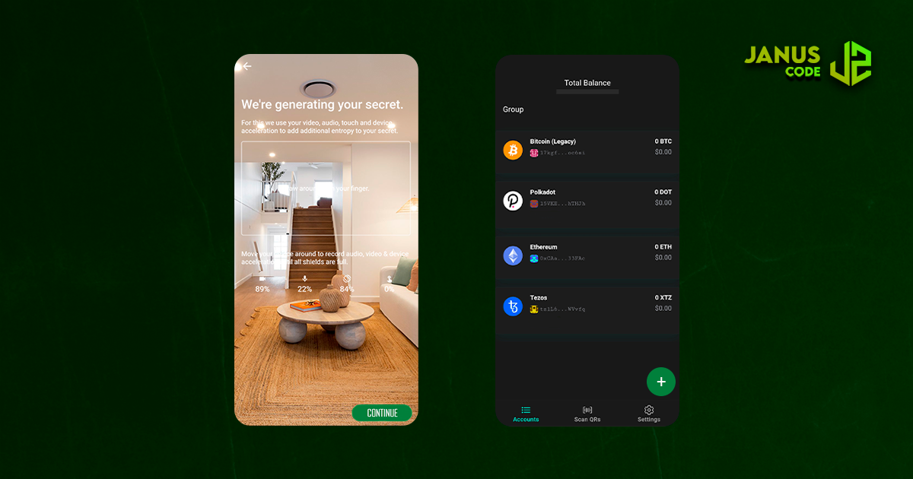

# Janus Code

<p align="left">
    
</p>

> Self custody made simple and secure. Protect your crypto and store your private keys offline.

[Janus Code Wallet](https://janusco.de) is a crypto wallet system that lets you secure cypto assets with one secret on an offline device. The Janus Code application is installed on a dedicated device that has no connection to any network, thus it is air gapped. The [Janus Code Wallet](https://github.com/januscod/januscode) is installed on your everyday smartphone.

## Description

Janus Code is responsible for secure key generation. Entropy from audio, video, touch and accelerometer are used together with the output of the hardware random number generator. The generated secret is saved in the secure enclave of the device, only accessible by biometric authentication. Accounts for multiple protcols can be created. Transactions are prepared by the Janus Code and then transferred to the offline device via QR code, where it is signed and sent back to the Wallet using another QR code.

<p align="left">
    
</p>

## Download

- [Google Play](https://play.google.com/store/apps/details?id=it.janus.code) Release 4th of March
- App Store Coming soon...

## Features

- Secure secret generation with added entropy from audio, video, touch and device accelerometer
- Secure storage using the secure enclave of the device, accessible only by biometric authenticaiton
- Secure, one-way communication with Janus Code over QR codes or URL-Schemes (app switching)
- Create accounts for all supported currencies like Solana, Bitcoin, Ethereum, Tezos, Cosmos, Kusama, Polkadot, USDC etc.
- Sign transactions offline without the secret ever leaving your device

## Security

The security concept behind Janus systems is to work with two physically separated devices, one of which has no connection to the outside world or any network. In the context of Janus, the component which has no internet connection is the Janus Code. The two components, Janus Code and Janus Code Wallet, communicate through one-way communication using QR codes.

### Key Generation

The entropy seeder uses the native secure random generator provided by the device and concatenates this with the sha3 hash of the additional entropy (audio, video, touch, accelerometer). The rationale behind this is:

- The sha3 hashing algorithm is cryptographically secure, such that the following holds: `entropy(sha3(secureRandom())) >= entropy(secureRandom())`
- Adding bytes to the sha3 function will never lower entropy but only add to it, such that the following holds: `entropy(sha3(secureRandom() + additionaEntropy)) >= entropy(sha3(secureRandom()))`
- By reusing the hash of an earlier "round" as a salt, we can incorporate the entire collected entropy of the previous round
- Native secure random cannot be fully trusted because there is no API to check the entropy pool it's using

The algorithm being used for the entropy seeding:

```typescript
const ENTROPY_BYTE_SIZE = 256
let entropyHashHexString = null

function toHexString(array) {
  return array
    .map(function (i) {
      return ('0' + i.toString(16)).slice(-2)
    })
    .join('')
}

function seedEntropy(additionalEntropyArray) {
  const secureRandomArray = new Uint8Array(ENTROPY_BYTE_SIZE)
  window.crypto.getRandomValues(secureRandomArray)
  console.log(entropyHashHexString + toHexString(secureRandomArray) + toHexString(additionalEntropyArray))
  entropyHashHexString = sha3_256(entropyHashHexString + toHexString(secureRandomArray) + toHexString(additionalEntropyArray))
  return entropyHashHexString
}
```

### Supply Chain Attacks

In the past years, mutliple cryptocurrency wallets have been targeted by attackers to try and steal users funds. One common attack vector is the supply chain attack. In this attack, the attacker tries to compromise a dependency that is used in the wallet and use it to inject malicious code. At Janus Code, we take utmost care of evaluating the dependencies we use. We have also introduced a system that separates the dependencies used during testing and development from the dependencies that are used to build and run the project. This reduces the risk of malicious code injection during the build and test steps.

### Security Audits

The application as a whole, as well as multiple components, have been audited by different third party companies.

**All audits have found no way of extracting the private key from Janus Code.**

The reports will be released once all the findings have been resolved.

## Build

First follow the steps below to install the dependencies:

```bash
$ npm install -g @capacitor/cli
$ npm install
```

Run locally in browser:

```bash
$ npm run start
```

Build and open native project

```bash
$ npm run build
$ npx cap sync
```

You can now open the native iOS or Android projects in XCode or Android Studio respectively.

```bash
$ npx cap open ios
$ npx cap open android
```

## Testing

To run the unit tests:

```bash
$ npm run install-test-dependencies
$ npm test
$ npm run install-build-dependencies
```

## Disclosing Security Vulnerabilities

If you discover a security vulnerability within this application, please send an e-mail to help@janusco.de. All security vulnerabilities will be promptly addressed.

## Contributing

Before integrating a new feature, please quickly reach out to us in an issue so we can discuss and coordinate the change.

- If you find any bugs, submit an [email](mailto:help@janusco.de).
- Engage with other users and developers on the [Janus Code Site](https://janusco.de).

## Related Projects

- [Janus Code Wallet](https://github.com/januscod/Janus-Code-Wallet)
- [Janus Code Linux Distribution](https://github.com/januscod/Janus-Code-Distro.git)
